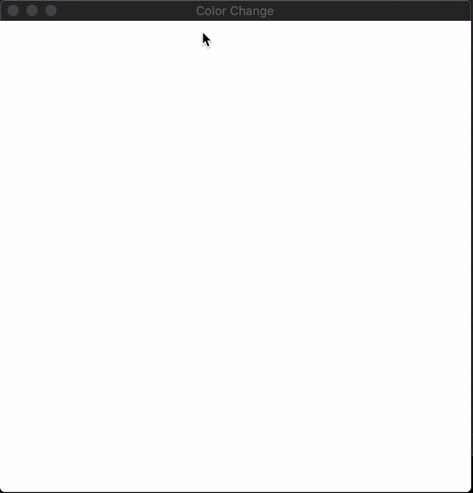

## x64 Assembly Color Changer
    The main program is colors.s and it is very simple, it just exports a single function `next_color` which updates the `background_color` value by cycling through 4 colors. The C frontend uses Raylib to display the color. This is a more portable way to interop with C from Assembly, because you don't have to worry about aligning the stack before making foreign C calls. The only thing you would have to mind would be the argument registers if your functions take arguments. But if instead of having C pass around values you keep your entire program state on the assembly side and just expose it to C via const pointers, const ints and return values then you don't need to really pay attention to the C abi at all. Press Space to Cycle the colors

